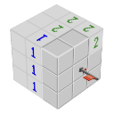

# 3DMinesweeper.com

Welcome to 3D Minesweeper! This readme file provides essential information and instructions on how to play this classic puzzle game with a twist.

## Table of Contents

1. [Introduction](#introduction)
2. [Game Objective](#game-objective)
3. [Getting Started](#getting-started)
4. [Game Rules](#game-rules)
5. [Controls](#controls)
6. [Feedback and Support](#feedback-and-support)
7. [License](#License)

---

## 1. Introduction

3D Minesweeper is a three-dimensional adaptation of the classic Minesweeper game. In this version, players navigate through a three-dimensional grid to uncover tiles, avoid mines, and clear the entire field without detonating any bombs. The game is a test of your logic, spatial awareness, and problem-solving skills.

## 2. Game Objective

The objective of 3D Minesweeper is to uncover all non-mine tiles on the grid without triggering any mines. To achieve this, you must use logic to deduce the locations of mines based on the numerical hints revealed when you click on a tile. The game is won when all non-mine tiles are revealed, and it's lost if you accidentally uncover a mine.

## 3. Getting Started

To play 3D Minesweeper, simply visit [3dminesweeper.com](https://www.3dminesweeper.com) in your web browser. There is no need to download or install any additional software.

## 4. Game Rules

- The game is played on a three-dimensional grid of tiles.
- Some tiles contain mines, while others do not.
- Left-click on a tile to reveal its content:
    - If it's a mine, the game is lost.
    - If it's a number, it indicates the number of adjacent mines.
    - If it's an empty tile, it will reveal an area without adjacent mines.
- Right-click on a tile to mark it as a mine.
- The game is won when all non-mine tiles are revealed, and it's lost when you uncover a mine.

## 5. Controls

- Left-click: Uncover a tile
- Right-click: Mark a tile as a mine
- Click and drag: Rotate the 3D grid for better visibility

## 6. Feedback and Support

I hope you enjoy playing 3D Minesweeper! If you have any feedback, encounter issues, or need assistance, please create an issue on the issues page.

Thank you for playing, and happy Minesweeping!

## 7. License
See [LICENSE](LICENSE)

